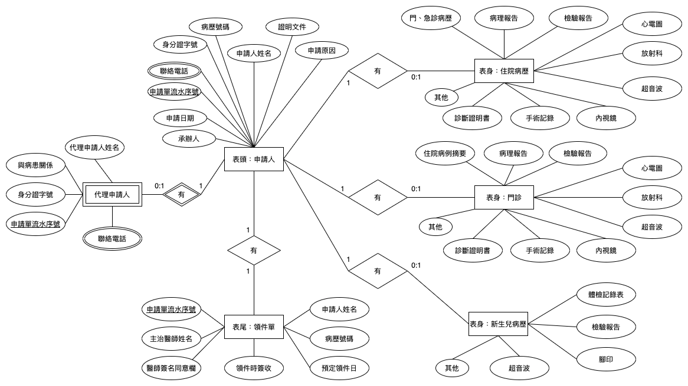

# Medical History Application System
## Video Demo
[Demo on youtube](https://www.youtube.com/watch?v=LArVJ1y2fQc&feature=youtu.be)
## Description
This website allow user patient to submit medical history application and access application data from database.

## Website Structure
- index.html - Homepage
- insert.html - User fill the form and submit application and user will get a unique application ID.
- Search.html - Query applicaiton data by applicaiton ID from database
- Manual.html - Contain ERD model of the website

## Development Information
- Front-end: HTML5, CSS, jQuery, Bootstrap
- Web Server: XAMPP
- Backend: PHP
- Database: MSSQL